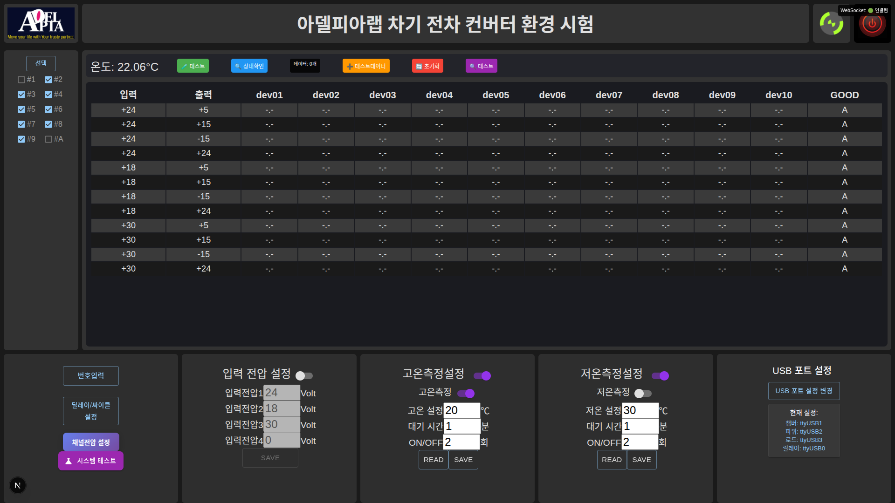
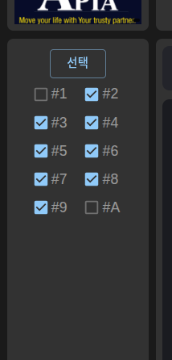
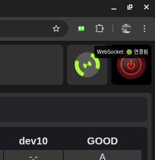
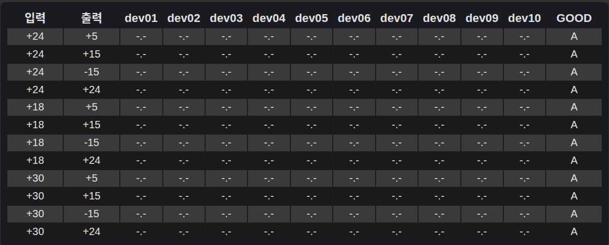
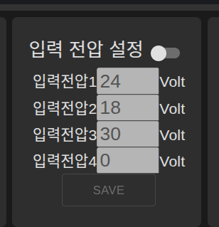
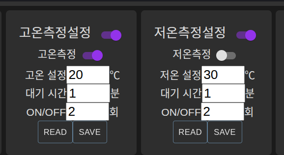
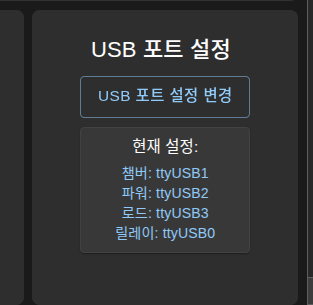
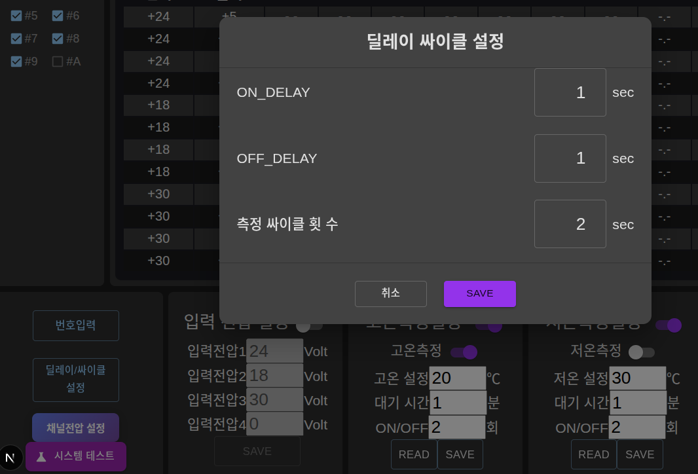

# ConvEnviTest 컴포넌트별 상세 가이드

## 📋 개요

이 문서는 ConvEnviTest 시스템의 각 UI 컴포넌트별 상세한 기능과 사용법을 설명합니다.

---



## 🏷️ 헤더 컴포넌트 (Header Components)

### LogoImage 컴포넌트
```typescript
// LogoImage.tsx
interface LogoImageProps {
  variant?: 'default' | 'debug';
  size?: 'small' | 'medium' | 'large';
}
```

#### 기능
- **브랜드 표시**: APPIA 로고와 슬로건 표시
- **반응형 크기**: 화면 크기에 따른 자동 크기 조정
- **디버그 모드**: 개발 시 디버그 정보 표시

#### 사용법
```jsx
<LogoImage variant="default" size="medium" />
```

### WebSocket 상태 표시

#### 기능
- **연결되어야 측정가능**:
- **연결 상태**: 실시간 WebSocket 연결 상태 표시
- **마지막 메시지**: 최근 수신된 메시지 표시
- **연결 시간**: 연결 시작 시간 표시

```typescript
// WebSocket 상태 컴포넌트
interface WebSocketStatusProps {
  isConnected: boolean;
  lastMessage?: string;
  connectionTime?: Date;
}
```


---

## 🎛️ 좌측 첵크 컴포넌트


### DeviceSelect 컴포넌트
```typescript
// DeviceSelect.tsx
interface DeviceSelectProps {
  selectedDevices: number[];
  onDeviceChange: (devices: number[]) => void;
  maxDevices?: number;
}
```

#### 기능
- **다중 선택**: 여러 장비를 동시에 선택 가능
- **체크박스 UI**: 직관적인 체크박스 인터페이스
- **선택 제한**: 최대 선택 가능한 장비 수 제한

#### 사용법
```jsx
<DeviceSelect 
  selectedDevices={[2, 4, 6, 8, 10]}
  onDeviceChange={handleDeviceChange}
  maxDevices={10}
/>
```

### TemperatureDisplay 컴포넌트

- **환경시험챔버온도**: 환경시험 온도조건표시
- **RS-232 serialport**: 
- **CSV report**: 전압측정 시 챔버온도 기록

```typescript
// 온도 표시 컴포넌트
interface TemperatureDisplayProps {
  temperature: number;
  unit: 'celsius' | 'fahrenheit';
  precision?: number;
  isRealTime?: boolean;
}
```

#### 기능
- **실시간 업데이트**: 온도 변화를 실시간으로 표시
- **단위 변환**: 섭씨/화씨 단위 변환 지원
- **정밀도 설정**: 소수점 자릿수 설정 가능

#### 사용법
```jsx
<TemperatureDisplay 
  temperature={22.06}
  unit="celsius"
  precision={2}
  isRealTime={true}
/>
```

### 시작/정지 버튼


```typescript
// 제어 버튼 컴포넌트
interface ControlButtonsProps {
  onTest: () => void;
  onStatusCheck: () => void;
  onAddData: () => void;
  onReset: () => void;
  dataCount: number;
  isTestRunning: boolean;
}
```

#### 기능
- **테스트 실행**: 수동 테스트 시작/중지
- **상태 확인**: 시스템 상태 점검
- **데이터 관리**: 테스트 데이터 추가/초기화
- **실행 상태**: 테스트 진행 상태 표시

---

## 📊 데이터 테이블 컴포넌트


### PowerTable 컴포넌트
```typescript
// PowerTable.tsx
interface PowerTableProps {
  data: PowerTableData[];
  onRowClick?: (row: PowerTableData) => void;
  onCellEdit?: (rowIndex: number, column: string, value: any) => void;
  isEditable?: boolean;
}
```

#### 데이터 구조
```typescript
interface PowerTableData {
  input: string;      // 입력 전압 (예: "+24V")
  output: string;     // 출력 전압 (예: "+5V")
  dev01: string;      // 장비 1 상태
  dev02: string;      // 장비 2 상태
  // ... dev03 ~ dev10
  good: 'A' | 'F' | 'P'; // 테스트 결과
}
```

#### 기능
- **실시간 데이터**: WebSocket을 통한 실시간 데이터 업데이트
- **편집 가능**: 셀 클릭으로 값 편집 가능
- **정렬 기능**: 컬럼별 정렬 지원
- **필터링**: 특정 조건으로 데이터 필터링

#### 사용법
```jsx
<PowerTable 
  data={powerData}
  onRowClick={handleRowClick}
  onCellEdit={handleCellEdit}
  isEditable={true}
/>
```

### 테이블 컬럼 설명

#### 입력/출력 전압 컬럼
- **입력 전압**: 테스트에 사용되는 기준 전압
- **출력 전압**: 각 채널에서 출력되는 전압값
- **단위**: V (볼트) 단위로 표시

#### 장비 상태 컬럼 (dev01 ~ dev10)
- **"--"**: 장비 비활성화 상태
- **실제 값**: 측정된 전압값 (예: "5.2V")
- **오류 표시**: 연결 오류 시 "ERR" 표시

#### 테스트 결과 컬럼 (GOOD)
- **"A"**: 테스트 통과 (Accept)
- **"F"**: 테스트 실패 (Fail)
- **"P"**: 테스트 진행 중 (Progress)

---

## ⚙️ 설정 패널 컴포넌트들

### InputVoltageSettings 컴포넌트



```typescript
// 입력 전압 설정 컴포넌트
interface InputVoltageSettingsProps {
  voltages: number[];
  onVoltageChange: (index: number, value: number) => void;
  onSave: () => void;
  onRead: () => void;
}
```

#### 기능
- **4개 입력 전압**: 테스트용 입력 전압 설정
- **실시간 검증**: 입력값 범위 검증 (0-50V)
- **저장/읽기**: 설정값 저장 및 불러오기

#### 사용법
```jsx
<InputVoltageSettings 
  voltages={[24, 18, 30, 40]}
  onVoltageChange={handleVoltageChange}
  onSave={handleSave}
  onRead={handleRead}
/>
```

### 고온/저온 시험 조건 설정


```typescript
// 온도 설정 컴포넌트
interface TemperatureSettingsProps {
  type: 'high' | 'low';
  enabled: boolean;
  temperature: number;
  waitTime: number;
  cycles: number;
  onToggle: (enabled: boolean) => void;
  onTemperatureChange: (temp: number) => void;
  onWaitTimeChange: (time: number) => void;
  onCyclesChange: (cycles: number) => void;
  onSave: () => void;
  onRead: () => void;
}
```

#### 기능
- **고온/저온 설정**: 온도 테스트 조건 설정
- **토글 스위치**: 온도 테스트 활성화/비활성화
- **범위**       : 온도 범위 (-99°C ~ 99°C)
- **대기 시간**: 온도 도달 후 대기 시간 설정
- **반복 횟수**: 테스트 반복 횟수 설정

#### 사용법
```jsx
<TemperatureSettings 
  type="high"
  enabled={true}
  temperature={-99}
  waitTime={60}
  cycles={2}
  onToggle={handleToggle}
  onTemperatureChange={handleTempChange}
  onWaitTimeChange={handleWaitTimeChange}
  onCyclesChange={handleCyclesChange}
  onSave={handleSave}
  onRead={handleRead}
/>
```

### UsbPortSettings 컴포넌트


```typescript
// USB 포트 설정 컴포넌트
interface UsbPortSettingsProps {
  ports: {
    chamber: string;
    power: string;
    load: string;
    relay: string;
  };
  onPortChange: (device: string, port: string) => void;
  onSave: () => void;
  availablePorts: string[];
}
```

#### 기능
- **포트 매핑**: 각 장비별 COM 포트 설정
- **포트 검증**: 사용 가능한 포트 목록 제공
- **연결 상태**: 각 포트의 연결 상태 표시

#### 사용법
```jsx
<UsbPortSettings 
  ports={{
    chamber: 'COM4',
    power: 'COM5',
    load: 'COM3',
    relay: 'COM6'
  }}
  onPortChange={handlePortChange}
  onSave={handleSave}
  availablePorts={['COM1', 'COM2', 'COM3', 'COM4', 'COM5', 'COM6']}
/>
```

---

## 🔧 제어 패널 컴포넌트들


### PowerSwitch 컴포넌트
```typescript
// 전원 스위치 컴포넌트
interface PowerSwitchProps {
  isOn: boolean;
  onToggle: (isOn: boolean) => void;
  isProcessing: boolean;
  wsConnection: WebSocket | null;
}
```

#### 기능
- **전원 제어**: 시스템 전원 ON/OFF 제어
- **실시간 상태**: 서버와 실시간 상태 동기화
- **처리 중 표시**: 테스트 진행 중 상태 표시
- **안전 확인**: 전원 끄기 전 안전 확인

#### 사용법
```jsx
<PowerSwitch 
  isOn={false}
  onToggle={handlePowerToggle}
  isProcessing={false}
  wsConnection={ws}
/>
```

### Delay/Cycle 컴포넌트



#### 기능
- **개별 제어**: 각 릴레이 개별 ON/OFF 제어
- **일괄 제어**: 모든 릴레이 동시 제어
- **상태 표시**: 각 릴레이의 현재 상태 표시
- **안전 제한**: 동시 활성화 제한

이 가이드는 ConvEnviTest 시스템의 모든 UI 컴포넌트에 대한 상세한 설명을 제공합니다. 각 컴포넌트의 기능과 사용법을 이해하여 효과적으로 개발하고 사용하시기 바랍니다.
