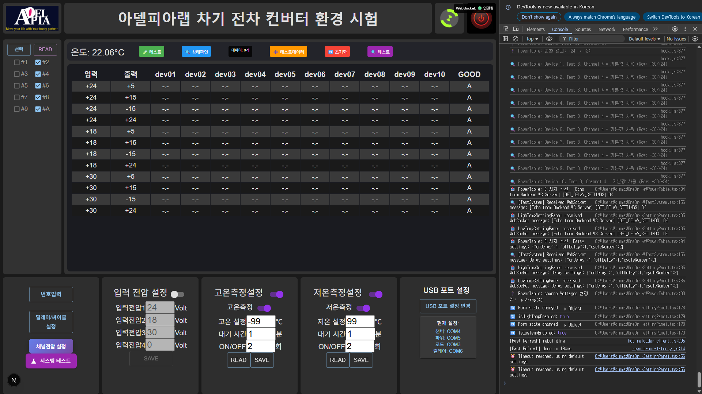

# ConvEnviTest 프론트엔드 UI 가이드

## 📋 개요

이 문서는 ConvEnviTest 환경 테스트 시스템의 프론트엔드 사용자 인터페이스(UI)의 각 부분에 대한 상세한 기능 설명을 제공합니다.

## 🖥️ 전체 화면 구조



```
┌─────────────────────────────────────────────────────────────────┐
│                    헤더 영역                                    │
├─────────────────────────────────────────────────────────────────┤
│                    상단 제어 바                                  │
├─────────────────────────────────────────────────────────────────┤
│                    메인 데이터 테이블                            │
├─────────────────────────────────────────────────────────────────┤
│  좌측 컨트롤 패널  │  중앙 설정 패널들  │  우측 설정 패널들    │
└─────────────────────────────────────────────────────────────────┘
```

---

## 🏷️ 헤더 영역 (Header Section)

### 로고 및 브랜딩
- **APPIA 로고**: "Move your life with your trusty partner" 슬로건과 함께 표시
- **프로젝트 제목**: "아델피아랩 차기 전차 컨버터 환경 시험"
- **WebSocket 상태 표시**: "WebSocket: 연결됨" - 실시간 연결 상태 표시

### 기능
- 시스템의 정체성과 브랜딩을 제공
- WebSocket 연결 상태를 실시간으로 모니터링
- 사용자에게 시스템의 신뢰성을 시각적으로 전달

---

## 🎛️ 상단 제어 바 (Top Control Bar)

### 선택 및 읽기 버튼
- **"선택" 버튼**: 장비 선택 모드를 활성화
- **"READ" 버튼**: 현재 설정값을 읽어와서 화면에 표시

### 장비 선택 체크박스 (#1 ~ #A)
- **10개 채널**: #1부터 #A까지의 릴레이 채널 선택
- **체크박스 상태**: 현재 선택된 채널 표시 (예: #2, #4, #6, #8, #A)
- **기능**: 특정 채널만 테스트하거나 제어할 때 사용

### 온도 모니터링
- **현재 온도 표시**: "온도: 22.06°C" - 실시간 챔버 온도
- **단위**: 섭씨 온도로 표시
- **업데이트**: 실시간으로 온도 변화 모니터링

### 테스트 및 데이터 버튼
- **"테스트" 버튼**: 수동 테스트 실행
- **"상태확인" 버튼**: 현재 시스템 상태 점검
- **"데이터: 0개"**: 현재 저장된 테스트 데이터 개수 표시
- **"+ 테스트데이터"**: 새로운 테스트 데이터 추가
- **"초기화"**: 시스템 설정을 기본값으로 초기화

---

## 📊 메인 데이터 테이블 (Main Data Table)

### 테이블 구조
```
| 입력 | 출력 | dev01 | dev02 | ... | dev10 | GOOD |
|------|------|-------|-------|-----|-------|------|
| +24V | +5V  |  --   |  --   | ... |  --   |  A   |
| +24V | +15V |  --   |  --   | ... |  --   |  A   |
| +24V | -15V |  --   |  --   | ... |  --   |  A   |
| +24V | +24V |  --   |  --   | ... |  --   |  A   |
```

### 컬럼 설명

#### 입력/출력 전압
- **입력 전압**: 테스트에 사용되는 입력 전압값 (+24V, +18V, +30V 등)
- **출력 전압**: 각 채널에서 출력되는 전압값 (+5V, +15V, -15V, +24V)

#### 장비 상태 (dev01 ~ dev10)
- **"--"**: 해당 장비가 비활성화 상태
- **실제 값**: 장비가 활성화되어 있을 때 측정된 전압값
- **10개 채널**: 각각의 릴레이/전원 장비 상태 표시

#### 테스트 결과 (GOOD)
- **"A"**: 테스트 통과 (Accept)
- **"F"**: 테스트 실패 (Fail)
- **"P"**: 테스트 진행 중 (Progress)

### 기능
- **실시간 모니터링**: 각 채널의 전압 상태를 실시간으로 표시
- **테스트 결과 추적**: 각 테스트 조건의 성공/실패 여부 표시
- **데이터 시각화**: 복잡한 전압 데이터를 표 형태로 정리

---

## 🎮 좌측 컨트롤 패널 (Left Control Panel)

### 기본 제어 버튼
- **"번호입력"**: 테스트 번호나 제품 번호 입력
- **"딜레이/싸이클 설정"**: 테스트 사이클의 딜레이 시간 설정
- **"채널전압 설정"**: 각 채널별 전압값 설정
- **"시스템 테스트"**: 전체 시스템 기능 테스트 실행

### 기능
- **빠른 접근**: 자주 사용하는 기능들을 한 곳에 모음
- **직관적 제어**: 복잡한 설정을 간단한 버튼으로 접근
- **시스템 진단**: 시스템 상태를 빠르게 확인

---

## ⚙️ 중앙 설정 패널들 (Center Setting Panels)

### 입력 전압 설정 패널
```
입력 전압 설정
├── 입력전압1: 24V
├── 입력전압2: 18V
├── 입력전압3: 30V
├── 입력전압4: 40V
└── [SAVE] 버튼
```

#### 기능
- **4개 입력 전압**: 테스트에 사용할 입력 전압값 설정
- **실시간 수정**: 값 변경 후 즉시 적용
- **저장 기능**: 설정값을 서버에 저장

### 고온측정설정 패널
```
고온측정설정
├── 고온측정: [ON/OFF 토글]
├── 고온 설정: -99°C
├── 대기 시간: 1분
├── ON/OFF: 2회
├── [READ] 버튼
└── [SAVE] 버튼
```

#### 기능
- **고온 테스트**: 고온 환경에서의 테스트 설정
- **온도 범위**: -99°C까지 설정 가능
- **대기 시간**: 온도 도달 후 대기 시간 설정
- **반복 횟수**: 테스트 반복 횟수 설정

### 저온측정설정 패널
```
저온측정설정
├── 저온측정: [ON/OFF 토글]
├── 저온 설정: 99°C
├── 대기 시간: 1분
├── ON/OFF: 2회
├── [READ] 버튼
└── [SAVE] 버튼
```

#### 기능
- **저온 테스트**: 저온 환경에서의 테스트 설정
- **온도 범위**: 99°C까지 설정 가능
- **대기 시간**: 온도 도달 후 대기 시간 설정
- **반복 횟수**: 테스트 반복 횟수 설정

---

## 🔧 우측 설정 패널들 (Right Setting Panels)

### USB 포트 설정 패널
```
USB 포트 설정
├── [USB 포트 설정 변경] 버튼
└── 현재 설정:
    ├── 챔버: COM4
    ├── 파워: COM5
    ├── 로드: COM3
    └── 릴레이: COM6
```

#### 기능
- **하드웨어 연결**: 각 장비가 연결된 COM 포트 표시
- **포트 변경**: USB 포트 설정을 변경할 수 있는 인터페이스
- **연결 상태**: 현재 연결된 장비들의 포트 정보 표시

### 추가 설정 패널들
- **채널 전압 설정**: 각 채널별 세부 전압 설정
- **딜레이 설정**: 테스트 프로세스의 시간 간격 설정
- **시스템 설정**: 전체 시스템의 기본 설정

---

## 🔄 실시간 기능들

### WebSocket 통신
- **실시간 데이터**: 서버와 실시간으로 데이터 교환
- **상태 동기화**: 클라이언트와 서버 간 상태 동기화
- **자동 업데이트**: 설정 변경 시 자동으로 화면 업데이트

### 데이터 저장
- **자동 저장**: 설정 변경 시 자동으로 JSON 파일에 저장
- **설정 복원**: 페이지 새로고침 시 이전 설정 자동 복원
- **백업 기능**: 중요한 설정값들의 백업 관리

### 오류 처리
- **연결 오류**: WebSocket 연결 실패 시 오류 메시지 표시
- **하드웨어 오류**: 장비 연결 실패 시 경고 표시
- **입력 검증**: 잘못된 입력값에 대한 경고 메시지

---

## 🎯 사용자 워크플로우

### 1. 초기 설정
1. **USB 포트 설정**: 각 장비의 COM 포트 확인 및 설정
2. **입력 전압 설정**: 테스트에 사용할 입력 전압값 설정
3. **온도 설정**: 고온/저온 테스트 조건 설정

### 2. 테스트 준비
1. **채널 선택**: 테스트할 릴레이 채널 선택 (#1~#A)
2. **전압 설정**: 각 채널별 출력 전압 설정
3. **딜레이 설정**: 테스트 사이클의 시간 간격 설정

### 3. 테스트 실행
1. **Power Switch**: 전원 스위치를 ON으로 설정
2. **자동 테스트**: 설정된 조건에 따라 자동 테스트 실행
3. **모니터링**: 실시간으로 테스트 진행 상황 확인

### 4. 결과 확인
1. **데이터 테이블**: 테스트 결과를 테이블에서 확인
2. **상태 확인**: 각 채널의 전압 및 상태 확인
3. **결과 저장**: 테스트 결과를 파일로 저장

---

## 🎨 UI/UX 특징

### 반응형 디자인
- **모바일 지원**: 작은 화면에서도 사용 가능
- **데스크톱 최적화**: 큰 화면에서 효율적인 레이아웃
- **터치 친화적**: 터치스크린에서도 사용 가능

### 직관적 인터페이스
- **한글 지원**: 모든 텍스트가 한글로 표시
- **색상 코딩**: 상태에 따른 색상 구분
- **아이콘 사용**: 기능을 직관적으로 표현하는 아이콘

### 접근성
- **키보드 네비게이션**: 키보드만으로도 모든 기능 사용 가능
- **고대비 모드**: 시각 장애인을 위한 고대비 지원
- **폰트 크기**: 가독성을 위한 적절한 폰트 크기

---

## 🔧 개발자 도구 연동

### 콘솔 로그
- **PowerTable 변환**: 전압값 변환 과정 로그
- **WebSocket 메시지**: 서버와의 통신 로그
- **상태 변경**: UI 상태 변화 로그
- **오류 메시지**: 발생한 오류들의 상세 정보

### 디버깅 기능
- **실시간 로그**: 개발자 도구에서 실시간 로그 확인
- **상태 추적**: 각 컴포넌트의 상태 변화 추적
- **성능 모니터링**: 렌더링 성능 및 메모리 사용량 모니터링

---

## 📱 모바일 대응

### 터치 인터페이스
- **터치 친화적 버튼**: 충분한 크기의 터치 영역
- **스와이프 제스처**: 데이터 테이블 스크롤 지원
- **반응형 레이아웃**: 화면 크기에 따른 자동 레이아웃 조정

### 모바일 최적화
- **간소화된 메뉴**: 모바일에서 필요한 기능만 표시
- **빠른 접근**: 자주 사용하는 기능을 상단에 배치
- **오프라인 지원**: 네트워크 연결이 불안정해도 기본 기능 사용 가능

---

## 🔒 보안 고려사항

### 데이터 보호
- **로컬 저장**: 민감한 설정은 로컬에만 저장
- **암호화**: 중요 데이터는 암호화하여 저장
- **접근 제어**: 권한이 있는 사용자만 설정 변경 가능

### 네트워크 보안
- **WebSocket 보안**: 로컬 네트워크에서만 WebSocket 연결
- **HTTPS 지원**: 보안 연결을 위한 HTTPS 지원
- **방화벽 설정**: 외부 접근을 제한하는 방화벽 설정

---

이 가이드는 ConvEnviTest 시스템의 프론트엔드 UI의 모든 부분에 대한 상세한 설명을 제공합니다. 각 기능을 이해하고 효과적으로 사용하시기 바랍니다.
