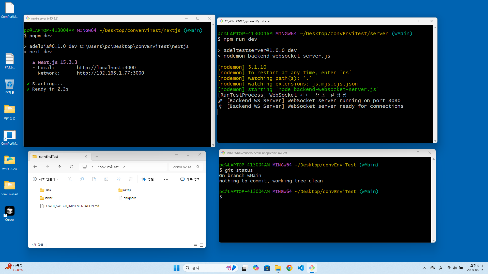
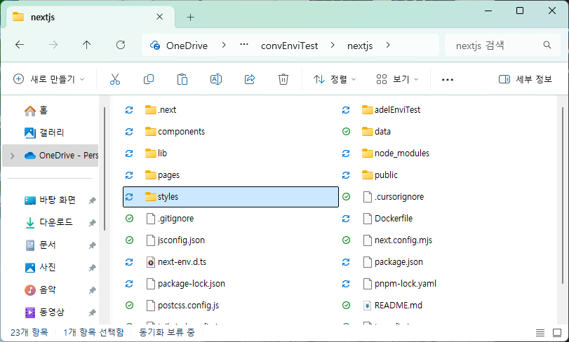
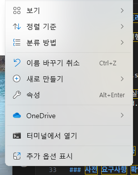
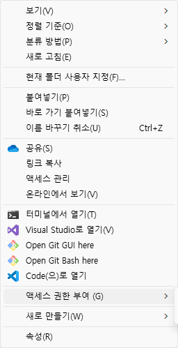
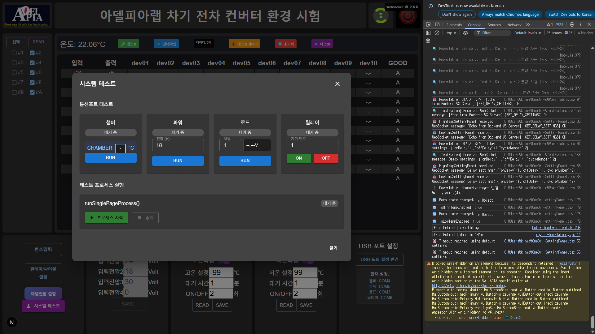
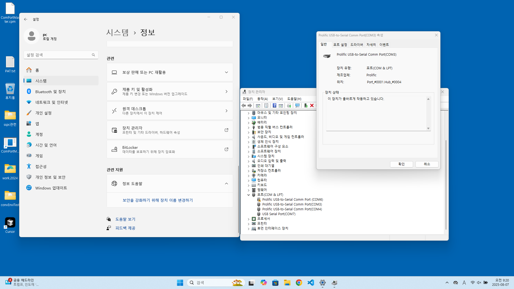

# ConvEnviTest RUN 가이드

## 📋 개요

이 문서는 ConvEnviTest 환경 테스트 시스템의 프로그램 실행  방법을 상세히 설명합니다.

## 1. 바탕화면의 convEnviTest 디렉토리 창을 더불클릭 한다

## 2. nextjs 디렉토리를 새창으로 열기 한다.

nextjs 디렉토리에서 우클릭

추가옵션클릭

Git Bash here 클릭

## 3. server Git Bash 창에 명령어를 실행 한다.

   ### 서버 프로그램 실행 명령(백엔드 프로그램)

   npm run dev
     
## 4. nextjs Git Bash 창에 명령어를 실행 한다.
   pnpm dev

## 5. 크롬 브라우저를 실행한다.
  ### 주소창에 localhost:3000 이동

## 6. 프론트엔드의 우측 하단 USB포트 설정을 클릭

## 7. 4개의 USB 포트를 설정 하고 저장한다.

## 8. USB PORT의 COM# 찻기

시스템 / 정보 / 장치관리자 / 포트 / 각포트를 더불클릭 하면

공유기의 번호에 할당된 COM 번호를 알 수 있음

## 9. 환경시험 시작 전 시스템 동작 확인 

프론트엔드의 좌측 하단 시스템테스터 창을 열어 

각 포트의 동작을 확인한다.

## 10. 환경시험 조건을 입력하기

모델명 입력

제품번호 입력

사이클 횟수 입력

## 11. 우측 상단의 전원버튼을 누르면 프로그램 시작

자세한 사용법은 `README.md` 파일을 참조하세요.
